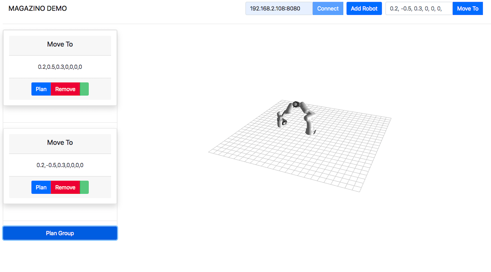

# Magazino Demo Frontend

Build with Angular and Bootstrap (for css)
A robot user interface integrated with ROS (Robot Operating System)

For the use-case Franka Panda Emika is used. The user interface is shown below

## Components

**AppComponent**: The main app component.

**RosConnectionComponent**: User interface to input ros connection address.

**AddRobotComponennt**: To add the robot to be used in the viewer

**ActionMoveToComponennt**: To use the move to action to move the robot in cartesian space.

**RobotViewerComponennt**: ThreeJs (webgl) viewer to render the 3D content

**DisplayActionComponent**: Component to display indiviual action that can be used on the robot.

**ActionPlanner**: Combination of multiple actions to be performed on robot.

## Services

**RosConnectionService** Service to maintain all the ros functionality with backend

**ActionMotionPlannerService** Service to maintain the motion planning request only in frontend.
Backend is maintained by RosConnectionService.

## External Libraries

Bootstrap 4, roslibjs, Ros3D
